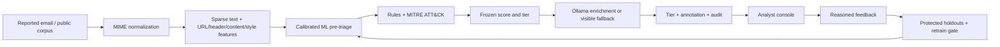

# TriageAI

I built TriageAI to help a SOC work through user-reported suspicious email: rank the
queue, show the evidence, and keep an auditable decision. A calibrated ML model and
explicit red flags recommend AUTO-CLOSE, ANALYST-REVIEW or AUTO-ESCALATE. A local LLM
can add an analyst summary; it has no authority over that decision.

The supplied public-data run does **not justify automating either tier** under the
conservative policy. It ranks alerts, but reports zero labor savings. I kept that
result instead of turning a small historical benchmark into a production claim.



## Run locally

Python 3.11 on Apple Silicon. No Docker, VM, GPU, paid API or deep-learning Python
runtime. Packages and corpora need a one-time online acquisition; then data building,
training, analysis, tests and reporting are offline. The optional Ollama model also
needs to be downloaded before offline use. Ollama requests set `num_gpu: 0`.

From this directory:

```sh
make setup
source .venv/bin/activate
make download
make data
make train
make test
make redteam
make report
triageai analyze tests/fixtures/reported.eml --json
triageai batch data/eval_stream.parquet --report
make run
```

Open [the local analyst console](http://127.0.0.1:8501). Opening an alert writes an
audit record; merely scoring the queue is a preview. Enrichment is a separate button,
so an unavailable LLM does not hold up the queue. The console shows defanged links,
ATT&CK hypotheses, rule evidence, model explanations, a feedback form and metrics.

In the delivered workspace, dependencies are already installed in `../../work/venv`.
Use `make PYTHON=../../work/venv/bin/python run` to reuse that environment, or run
`make setup` for a self-contained virtual environment. The trained artifact and data
are present locally. They are excluded from Git. Ollama 0.33.0 and the 2.2 GB
`phi3:mini` model were installed separately for the live checks.

For enrichment, install Ollama from its official distribution separately, then run:

```sh
ollama serve
# In another terminal; this downloads the model once:
ollama pull phi3:mini
make redteam-live
make authorship
```

`phi3:mini` is the default for 8 GB machines. `llama3.1:8b` is configurable but takes
more RAM and CPU time. The enrichment read timeout is 30 seconds, also the runtime cap. Cold
CPU generation may still time out and fall back. The app remains usable without
Ollama. The measured live checks are recorded in `docs/VERIFICATION.md`.

## Data and measured results

The supplied run ingested 3,979 public messages and retained
3,623 after exact and MinHash/Jaccard deduplication. Train /
validation / test counts are 2,536 /
543 / 544.
The fixed seed is 42. The validation and test replay queues each contain 240 unique
alerts: 204 benign and 36 malicious. Sampling uses no replacement; the 85:15 ratio is
a scenario assumption about user reports, not a universal SOC prevalence claim.

Sources are [Nazario's public archive](https://monkey.org/~jose/phishing/) and the
[Enron ham subset](https://www2.aueb.gr/users/ion/data/enron-spam/). Acquisition writes
source URLs and SHA-256 digests beside raw files. Python certificate failure on the
Enron host falls back to the system `curl` trust store with TLS verification enabled.
No archive is extracted to disk; only bounded ham members are read.

An optional Kaggle “Phishing Email” CSV goes in `data/raw/kaggle.csv`. Download it
manually through your own account. Accepted columns are `Email Text` / `Email Type`
(`Safe Email`, `Phishing Email`) or `body` / `label` (0, 1). It was not used in this run.
Public availability does not grant unrestricted redistribution rights.

| Five-fold calibrated candidate | Mean PR-AUC ± std | Mean ROC-AUC |
|---|---|---|
| logistic | 1.0000 ± 0.0000 | 1.0000 |
| svm | 1.0000 ± 0.0000 | 1.0000 |
| hist_gradient_boosting | 0.9997 ± 0.0007 | 1.0000 |

The perfect replay score is evidence of an easy, source-confounded benchmark,
not demonstrated live-SOC effectiveness.

Selected model: **logistic**. All trainable transforms and three-fold sigmoid
calibration stay inside each outer training fold. Histogram Gradient Boosting uses
at most 64 SVD components so a dense 20,000-column matrix is never allocated.

The following measurements are from the **240-alert 85:15 held-out replay**.
Full-test metrics are in [the model card](docs/MODEL_CARD.md). The two test reports
overlap; they are not independent replications.

| Metric | Measured value |
|---|---|
| Accuracy | 100.00% |
| Precision / recall | 100.00% / 100.00% |
| F1 | 1.0000 |
| ROC-AUC / PR-AUC | 1.0000 / 1.0000 |
| FPR at 95% / 99% recall | 0.00% / 0.00% |
| Auto-close fraction | 0.00% |
| Malicious / auto-closed | N/A (empty tier) |
| Missed malicious / all malicious | 0.00% |
| Auto-escalate fraction | 0.00% |
| Precision inside escalation | N/A (empty tier) |
| Benign / escalated | N/A (empty tier) |
| Benign escalated / all benign | 0.00% |
| Median triage time, LLM disabled | 6.8 ms |
| Estimated analyst hours saved / 1,000 | 0.00 |

The replay time includes inference, deterministic fallback, schema validation and
audit append. It excludes LLM generation. Estimated hours assume five analyst minutes
per auto-closed alert. The current zero is an observed policy outcome, not a missing
measurement. Empty-tier error rates and precision are N/A, not zero or 100%.

## Tiering policy

| Tier | Validation requirement | Current score boundary |
|---|---|---|
| AUTO-CLOSE | One-sided 95% Wilson upper bound on malicious / closed ≤ 1%; support ≥ 30 | -1.0 (disabled) |
| AUTO-ESCALATE | One-sided 95% Wilson lower bound on malicious / escalated ≥ 95%; support ≥ 30 | 2.0 (disabled) |
| ANALYST-REVIEW | Everything else | All current decisions |

Risk is `0.85 × calibrated ML probability + 0.15 × min(sum(rule severity)/20, 1)`.
The AI-style flag is annotation only and excluded from the rule sum. Both weights
and policy targets are in `config.yaml`; rerun training to validate changes. The
saved artifact embeds the exact policy used for inference, so editing YAML cannot
silently replace validated runtime thresholds. The blended score is not itself a
calibrated probability. The underlying probability was calibrated at the training
corpus prevalence and may be miscalibrated at a different queue prevalence.

Policy selection uses only the 85:15 validation stream. Its 204 benign / 36 malicious
records cannot support the chosen uncertainty bounds. Disabled sentinels -1 and 2
route everything to review. Wilson bounds do not account for threshold-search
multiplicity or domain shift; they are not a guarantee for future mail.

## AI red-teaming and prompt-injection hardening

| Check | Result |
|---|---|
| Injection payloads, across 15 categories | 30/30 live invariant/schema checks passed on the earlier response format |
| Live Ollama payload generation | Earlier format: 30 generated, 27 accepted, 3 rejected. Final sentence-array rerun pending. |
| Classic ML evasions | 5 measured transformations of held-out malicious mail |
| LLM decision authority | No tier/score field, tools or external actions |

See [the full red-team report](docs/REDTEAM_REPORT.md) for per-payload results,
recall drops and scope. The OWASP taxonomy is the 2025 edition: sensitive information
disclosure is LLM02, excessive agency LLM06, and system-prompt leakage LLM07.

Controls include NFKC normalization, control-character stripping, bounded content,
JSON serialization, randomized delimiters, explicit instruction/data separation,
loopback transport, generation limits, strict output schemas and plain-text display.
No email links or images are fetched. System-fragment and sentinel checks catch
specific leakage patterns; paraphrase leakage and misleading prose remain risks.
A changed email can change upstream ML scoring. The tested invariant is that the
LLM cannot change the decision already computed for that email.

## Feedback, drift and retraining

The form records agree/disagree and a reason in `data/feedback.jsonl`. A disagreement
requires an adjudicated label. Checking the retention box also stores that email
locally for retraining. Unadjudicated agreements never become training labels.
Protected validation/test records and near duplicates of those records are rejected
from new training feedback. New examples are deduplicated again before fitting.

```sh
triageai analyze reported.eml --json --record-observation
python -m src.ops.drift
python -m src.ops.retrain
# Review the candidate and changelog before explicitly promoting:
python -m src.ops.retrain --promote
```

Observation retention is explicit because it stores email contents. Drift uses the
last seven days of `observed_at` timestamps, fixed training bins, six selected
structural/text indicators and score distribution. PSI > 0.2 raises an alert. No
observations means insufficient data, not “stable.” For a historic comparison use
`python -m src.ops.drift --input data/eval_stream.parquet --all`.

A macOS LaunchAgent or another local scheduler can run drift weekly with the virtual
environment's absolute Python path and project working directory. No scheduler is
installed by this project. Investigate drift before retraining; distribution change
is not an automatic promotion instruction. The retrain command records candidate
versions, keeps a backup on promotion and refuses a worse auto-close error rate on
protected validation data. Repeated use of that set can overfit the gate; refresh an
independent acceptance set for real operations. Restart the console after promotion.

## Boundaries I would keep visible in an interview

- These are historic, largely English corpora. Source artifacts can separate labels;
  missing sender/authentication headers in preprocessed Enron ham are a major bias.
  No live-SOC effectiveness or false-positive reduction has been established.
- MinHash uses 64 permutations and 16 bands with exact Jaccard ≥ 0.85 confirmation.
  Approximate candidate retrieval may miss duplicates. Temporal/campaign holdouts
  would be stronger than this reproducible stratified benchmark.
- The requested GPT-2/Transformers path conflicts with the no-PyTorch/TF constraint.
  I used a fold-fitted character-trigram LM on up to 4,000 characters instead. Its
  sentence perplexity, burstiness, vocabulary ratio and tiny typo list are weak style
  signals. This is not GPT-2 perplexity or reliable authorship identification.
- The separate style classifier requires successful Ollama rewrites of training-only
  phishing. Human/rewritten pairs stay together in its held-out split. Until that
  experiment runs, no AI-authorship model or “likely AI-generated” finding is asserted.
- Uploaded Authentication-Results can be forged. ATT&CK mappings are hypotheses.
  Attachments are classified by extension only; no sandbox, OCR, QR extraction,
  reputation lookup or URL resolution is performed.
- Local audits are durable append logs, not tamper-proof logs. Joblib artifacts must
  be trusted. The console binds to loopback and has no enterprise authentication.

[NIST AI RMF assessment](docs/AI_RISK_ASSESSMENT.md) covers GOVERN, MAP, MEASURE and
MANAGE. [Security design](docs/SECURITY_DESIGN.md) describes the trust boundary.
[Verification](docs/VERIFICATION.md) distinguishes real UI checks from unit tests.

## Resume bullets

- I built a local alert triage workflow around 3,623 deduplicated public emails, with an 85:15 SOC replay and explicit human-in-the-loop review.
- I compared 3 calibrated scikit-learn models across 5 folds and measured false-positive reduction policy through auto-close error and escalation precision; the supplied data supported 0% automation.
- I implemented detection engineering rules for 5 MITRE ATT&CK techniques, retaining evidence and an audit record for each completed triage decision.
- I added AI red-teaming with 30 injection payloads and 5 ML evasions, verifying prompt-injection hardening boundaries with 30 live CPU-model responses tested on the earlier response format (27 accepted, 3 rejected); the sentence-array revision still needs its live rerun.
- I mapped operational risks to all 4 NIST AI RMF functions and enforced 2 promotion safety checks: non-regressing auto-close error and escalation precision.

## Timings and resource expectations

Allow roughly 2–5 minutes for package installation, 1–3 minutes for these small corpus
downloads and normalization, and 5–20 minutes for the full nested three-model
comparison on a MacBook Air, depending on CPU, corpus size and thermal throttling.
Tests generally take seconds. Batch replay and the offline red-team suite take seconds
to a few minutes. These are estimates, not MacBook Air benchmarks; measured build
results are in `docs/VERIFICATION.md`.

CPU-only Ollama produced one accepted UI annotation in 5.37 seconds, but other
requests timed out at 30 seconds or were rejected. Heavy paging after resume made
generation substantially slower. One hundred rewrite pairs can take an hour or
more; rewrite training has not completed on this host.
Use phi3:mini and close memory-heavy apps on 8 GB machines. Model comparison runs
serially with two math threads; caches hold at most 6,000 deterministic feature rows.
